منذ الرضى الذي أظهرته مريم بالإيمان، في يوم البشارة، و الذي احتفظت به على ثباته قرب الصليب، تمتد أمومتها إلى أخوة ابنها و أخواته "الذين لم ينته شوطهم بعد، و إنما يعانون وطأة المشاق و المحن". إن يسوع، الوسيط الوحيد، هو طريق صلاتنا. و مريم، أمه و أمنا، هي شفافة أمامه: إنها "تدل على الطريق" (الهادية أو المرشدة)، إنها "آتية"، بحسب رسم الايقونات التقليدي في الشرق و الغرب. (كتاب التعليم المسيحي للكنيسة الكاثوليكية، فقرة 2674)

مريم هي المصلية الكاملة رمز الكنيسة. و عندما نصلي إليها، نعتنق معها قصد الأب الذي يرسل ابنه ليخلص جميع البشر. و كالتلميذ الحبيب، نقبل عندنا أم يسوع التي صارت أم جميع الأحياء. فنستطيع أن نصلي معها و إليها. و صلاة الكنيسة كأنها محمولة بصلاة مريم. و هي تتحد بها في الرجاء. (كتاب التعليم المسيحي للكنيسة الكاثوليكية، فقرة 2679)

---
--- 

# أسرار الفرح:  
ليومي الإثنين والسبت، ومن زمن المجيء إلى أحد الكهنة

### - البشارة: التواضع  

**أقدّم لكِ أيتها البتول الطوباويّة، جزيل الفرح الذي فرحته، لمّا بشّرك الملاك جبرائيل بالحبل الإلهي.**

٢٦وفي الشَّهرِ السَّادِس، أَرسَلَ اللهُ المَلاكَ جِبرائيلَ إِلى مَدينَةٍ في الجَليلِ ٱسْمُها النَّاصِرَة، ٢٧إِلى عَذْراءَ مَخْطوبَةٍ لِرَجُلٍ مِن بَيتِ داودَ ٱسمُه يوسُف، وَٱسمُ العَذْراءِ مَريَم. ٢٨فدَخَلَ إِلَيها فَقال: «إِفرَحي، أَيَّتُها المُمتَلِئَةُ نِعْمَةً، الرَّبُّ مَعَكِ». (لوقا 1: 26-38)

**تأمل:** يا مريم، لقد اظهرتِ تواضعك، وخضوعك الكامل لمشيئة الآب، لما بشّرك ملاكه جبرائيل بالحبل العجيب. كان جوابك “نعم”، بدَّلت به وجه البشرية، فتحقّق الخلاص للعالم بيسوع إبنك. إجعلينا يا مريم، ان نكون على مثالك، نُسلم حياتنا بثقة للآب السماوي، فيتم كل شيء بحسب مشيئته القدوسة، آمين.

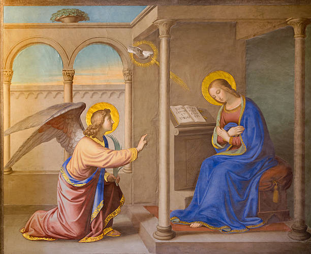

--- 

###  الزيارة: محبة القريب  

**أقدّم لك أيّتها البتول الطوباوية، جزيل الفرح الذي فرحته، لما زرت نسيبتك القدّيسة أليصابات.**

وفي تلكَ الأَيَّام قامَت مَريمُ فمَضَت مُسرِعَةً إِلى الجَبَل إِلى مَدينةٍ في يَهوذا. ٤٠ودَخَلَت بَيتَ زَكَرِيَّا، فَسَلَّمَت على أَليصابات. ٤١فلَمَّا سَمِعَت أَليصاباتُ سَلامَ مَريَم، اِرتَكَضَ الجَنينُ في بَطنِها، وَٱمتَلأَت مِنَ الرُّوحِ القُدُس، ٤٢فَهَتَفَت بِأَعلى صَوتِها: «مُبارَكَةٌ أَنتِ في النِّساء! وَمُبارَكَةٌ ثَمَرَةُ بَطنِكِ! (لوقا 1: 39-42)

**تأمّل:** أيّتها البتول القدّيسة، يا من بمحبّتك الفائقة، زرت نسيبتك أليصابات، لكي تخدمينها، وهي تحمل من سيمهّد الطريق أمام إبنك المخلّص الفادي. نسألك أيّتها الأم النقيّة أن تمنحينا هذه النعمة، وهي محبّة وخدمة القريب، خدمة مجّانية مجرّدة، فتكون لقاءاتنا وزياراتنا كلّها، في خدمة الله ومجد اسمه القدّوس، حينئذٍ نستحقّ أن ندعى له أبناء، آمين.

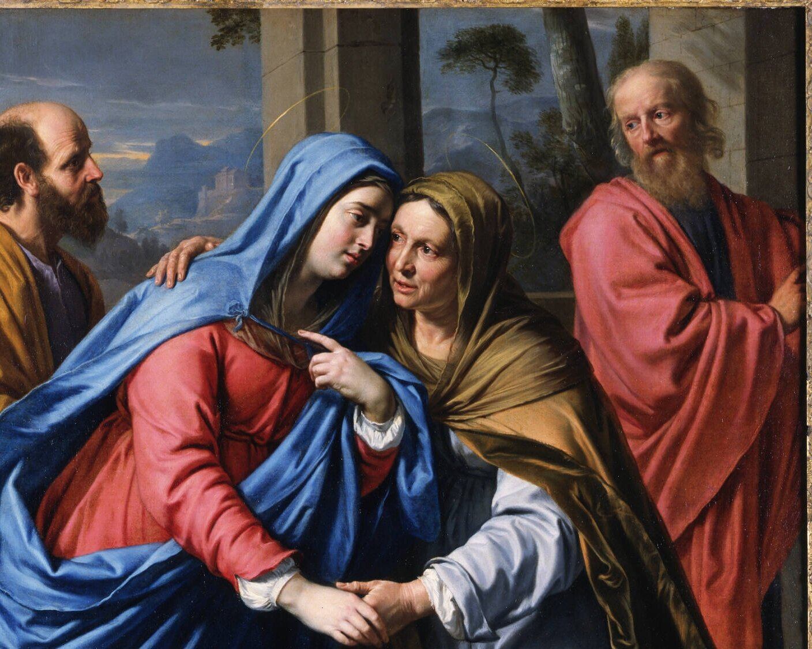
  
---

### الميلاد: التجرد  

**قدّم لكِ أيتها البتول الطوباويّة، جزيل الفرح الذي فرحته، لمّا ولدت يسوع في مغارة بيت لحم**

	١وفي تِلكَ الأَيَّام، صَدَرَ أَمرٌ عنِ القَيصَرِ أَوغُسطُس بِإِحْصاءِ جَميعِ أَهلِ المَعمور. ٢وجَرى هٰذا الإِحصاءُ الأَوَّلُ إِذ كانَ قيرينِيوس حاكمَ سورية. ٣فذَهبَ جَميعُ النَّاسِ لِيَكتَتِبَ كُلُّ واحِدٍ في مَدينَتِه. ٤وصَعِدَ يوسُفُ أَيضًا مِن الجَليل مِن مَدينَةِ النَّاصِرَة إِلى اليَهودِيَّةِ إِلى مَدينَةِ داودَ الَّتي يُقالُ لَها بَيتَ لَحم، فقَد كانَ مِن بَيتِ داودَ وعَشيرتِه، ٥لِيَكتَتِبَ هو ومَريمُ خَطيبَتُه وكانَت حامِلًا. ٦وبَينا هما فيها حانَ وَقتُ وِلادَتِها، ٧فولَدَتِ ٱبنَها البِكرَ، فَقَمَّطَته وأَضجَعَته في مِذوَدٍ لأَنَّه لم يَكُنْ لَهُما مَوضِعٌ في المَضافة. (لوقا 2: 1-7)

**تأمّل:** لقد وضعت أيّتها الطاهرة، طفلك يسوع في مذود حقير، في مغارة، وهو من خلق العالم وكلّ ما فيه. لقد بدّل هذا اليوم وجه الأرض، فولد الخلاص لجميع الشعوب. ولدت يسوع ربّك وإلهك! يا لعظمة أحكامك يا الله! وكم هي عظيمة محبّتك لنا، تصاغرت وصرت منّا، لتقرّبنا منك. أعطنا يا ربّ بشفاعة مريم أمّك، أن نفهم هذه المحبّة، لكي نعيشها مع إخوتنا كما أوصيت، آمين.

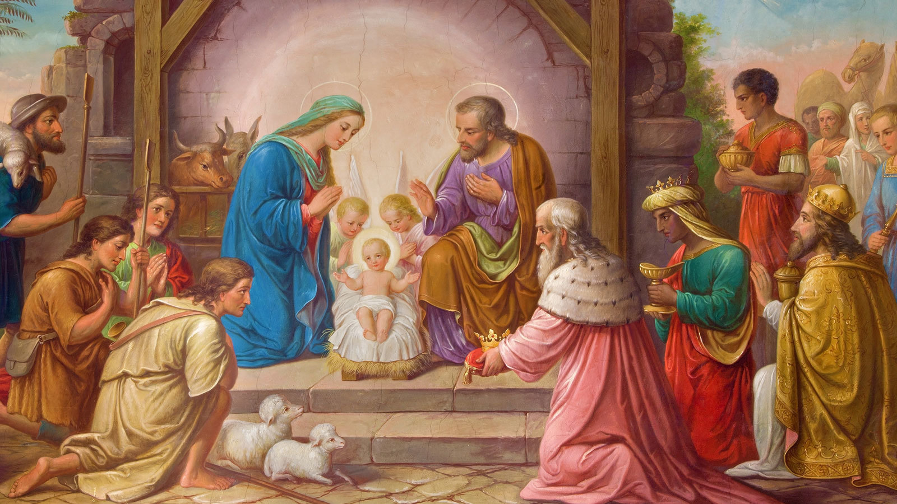

---

### تقدمة يسوع إلى الهيكل: الطهارة  

**أقدّم لكِ أيّتها البتول الطوباويّة، جزيل الفرح الذي فرحته، لمّا قدّمت ابنك يسوع إلى الله على يد سمعان الشيخ في الهيكل.**

(لوقا 2: 21-24)
٢١ولَمَّا ٱنقَضَت ثَمانِيَةُ أَيَّامٍ فحانَ لِلطِّفْلِ أَن يُختَن، سُمِّيَ يسوع، كما سَمَّاهُ المَلاكُ قَبلَ أَن يُحبَلَ بِه ٢٢ولَمَّا حانَ يَومُ طُهورِهما بِحَسَبِ شَريعَةِ موسى، صَعِدوا به إِلى أُورَشَليم لِيُقَدِّماه لِلرَّبّ، ٢٣كما كُتِبَ في شَريعةِ الرَّبِّ مِن أَنَّ كُلَّ بِكرٍ ذَكَرٍ يُنذَرُ لِلرَّبّ، ٢٤ولِيُقَرِّبا كما وَرَدَ في شَريعَةِ الرَّبّ: زَوْجَيْ يَمَامٍ أَو فَرخَيْ حَمام.

**تأمّل:** يا مريم، لقد حملَتك طاعتك للشريعة مع القدّيس يوسف أن تقرّبا يسوع إلى الله، على يد سمعان الشيخ، الرجل البار. قدّمت ابنك إلى الهيكل وهو سيّد الهيكل، من قرّب نفسه ذبيحة لأجل خلاص العالم. ساعدينا يا أمّنا، أن ندرك عظمة هذا السرّ العجيب، سرّ افتداء البشر، فنعيش طوال حياتنا، في محبّة الله تعالى، الذي وهبنا دون استحقاق، ابنه الوحيد لافتدائنا، آمين.

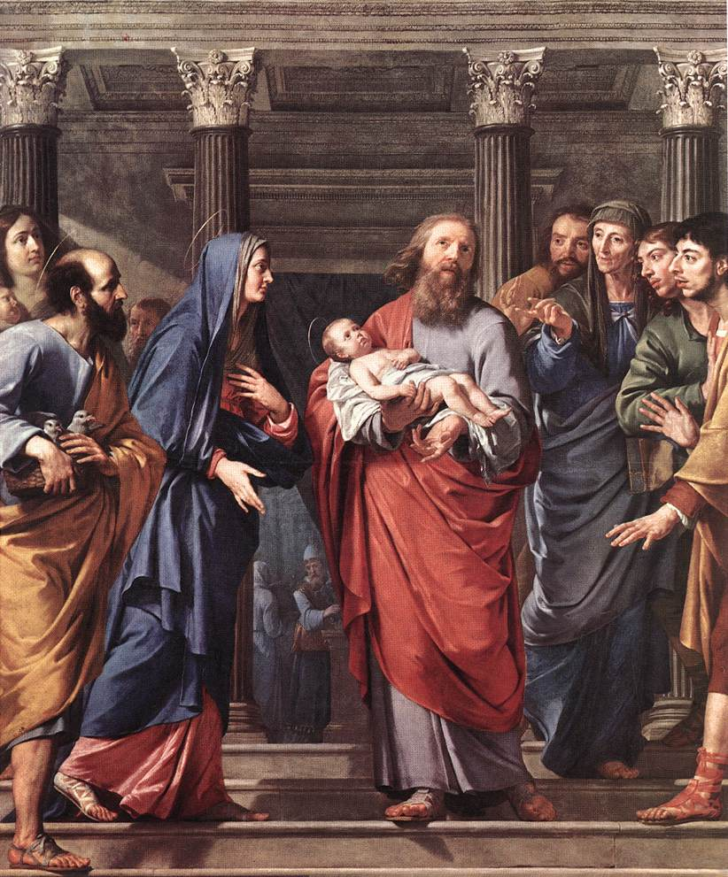

---

### وجود يسوع في الهيكل: الطاعة  

**أقدّم لكِ أيّتها البتول الطباويّة، جزيل الفرح الذي فرحته، لمّا وجدتِ يسوع في الهيكل بين العلماء يسمع إليهم ويسألهم.**

**تأمّل:** بعد ثلاثة أيّام، من العناء والقلق واللهفة، وجدت أيّتها الأم الحنون، ابنك يسوع في الهيكل بين العلماء. فزال خوفك، وحلَ السلام والفرح والطمأنينة في قلبك الطاهر. علّمينا يا مريم، أنّه لا نقدر أن نجد يسوع، إلّا بالاجتهاد والسعي المتواصل، والعمل والسير بصبر في مسيرة حياتنا الشاقّة. وقتئذٍ فقط، نجد الطمأنينة والسلام، والفرح الحقيقي الذي لا يزول، فرح اللقاء مع يسوع، آمين.

(لوقا 2: 41-49)
٤١وكانَ أَبَواهُ يَذهَبانِ كُلَّ سَنَةٍ إِلى أُورَشَليمَ في عيدِ الفِصْح. ٤٢فلَمَّا بَلَغَ ٱثنَتَيْ عَشْرَةَ سَنَة، صَعِدوا إِلَيها جَرْيًا على السُّنَّةِ في العيد. ٤٣فَلَمَّا ٱنقَضَت أَيَّامُ العيدِ ورَجَعا، بَقِيَ الصَّبِيُّ يسوعُ في أُورَشَليم، مِن غَيرِ أَن يَعلَمَ أَبَواه. ٤٤وكانا يَظُنَّانِ أَنَّه في القافِلة، فَسارا مَسيرَةَ يَومٍ، ثُمَّ أَخذا يَبحَثانِ عَنهُ عِندَ الأَقارِبِ والمَعارِف. ٤٥فلَمَّا لَم يَجداه، رَجَعا إِلى أُورَشَليمَ يَبحَثانِ عنه. ٤٦فوَجداهُ بَعدَ ثَلاثَةِ أَيَّامٍ في الهَيكَل، جالِسًا بَينَ العُلَماء، يَستَمِعُ إِلَيهم ويسأَلُهم. ٤٧وكانَ جَميعُ سامِعيهِ مُعجَبينَ أَشَدَّ الإِعجابِ بِذَكائِه وجَواباتِه. 

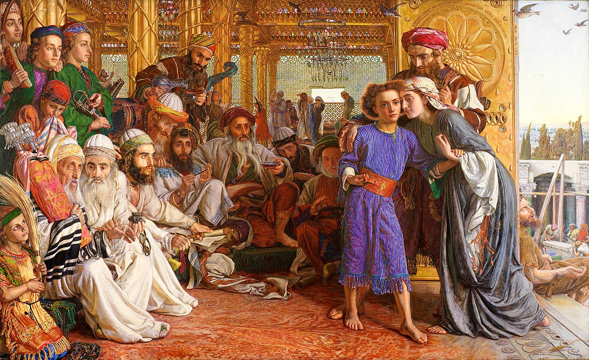

---
---

# أسرار النور:
ليوم الخميس 

التقدمة: أيَّتُها العذراء القدّيسة، سُلطانَة الوَرديّة المقدّسة، إنَّنا نُصَلّي ونتأمَّل بِخَمسَة أسرار النور، المُتألِّقَة في حَياة ابنِكِ العَلَنيَّة، والمُشِعّة عَلَيك وعَلَينا، وَنُقَدِّمها مِن أجل إخوَتِنا الذين لا يَزالون في ظِلمَة الإبتِعاد عن ابنِك، مُتَوَسِّلين إلَيه بِشَفاعتك، لِيَفتَح بَصائرهم، ويُضيء دُروبَهُم، فَيَكتَشِفوا فيه النّور الذي جاء إلى العالَم لِيُخَلِّصهم. آمين.
### المعمودية: البنوة للآب

**أقدّم لك أيّتها البتول الطوباويّة، جزيل النور الذي أفيض عليك، لمّا اعتمد يسوع على يدّ يوحنّا في نهر الأردن.**

(متى 3: 16-17) 
١٦وٱعتَمَدَ يسوع وخَرَجَ لِوَقتِه مِنَ الماء، فإِذا السَّمَواتُ قدِ ٱنفَتَحت فرأَى رُوحَ اللهِ يَهبِطُ كأَنَّه حَمامةٌ ويَنزِلُ علَيه. ١٧وإِذا صَوتٌ مِنَ السَّمَواتِ يَقول: «هٰذا هُوَ ٱبنِيَ الحَبيبُ الَّذي عَنه رَضِيت».

**تأمّل:** يسوع ينحني أمام يوحنّا في نهر الأردن ليعتمد. فانفتحت السماوات، وهبط الروح القدس عليه كأنّه حمامة، وإذا بصوت الآب يعلن إبنه الوحيد للعالم: “هذا هو ابني الحبيب الذي به رضيت”. ويرسله لكي يتمّم محبّته وعهده لمن أحبّهم.أطلبي لنا يا أمّنا، نعمة لنفهم مشروع الله في حياتنا، ونتمّم مشيئته فينا، فنسمع صوته يقول لكل منّا: “هذا هو ابني الحبيب…”. آمين.

--- 

### عرس قانا الجليل: التجدد بالروح القدس  

**أقدّم لك أيّتها البتول الطوباويّة، جزيل النور الذي أفيض عليك، لمّا أظهر إبنك يسوع مجده في عرس قانا الجليل، فحوّل لطلبك الماء إلى خمر.**

(يوحنا 2: 1-5)
1 وفي اليَومِ الثَّالِث، كانَ في قانا الجَليلِ عُرسٌ وكانَت أُمُّ يَسوعَ هُناك. ٢فدُعِيَ يسوعُ أَيضًا وتلاميذُه إِلى العُرس. ٣ونَفَدَتِ الخَمْر، فقالَت لِيَسوعَ أُمُّه: «لَيسَ عِندَهم خَمْر». ٤فقالَ لها يسوع: «ما لي وما لكِ، أَيَّتُها المَرأَة؟ لَم تَأتِ ساعتي بَعْد». ٥فقالَت أُمُّه لِلخَدَم: «مَهما قالَ لَكم فٱفعَلوه».

**تأمّل:** لقد حان الوقت ليظهر إبنك مجده أمام الجميع. ولم يكن حضورك صدفة في العرس، لأنّك كنت دائمًا بقربه حتّى الصليب. فهمت وأدركت كلّ شيء منذ لحظة بشارتك. ولم يستجب يسوع طلبك تحويل الماء إلى خمر رغم أنّ “ساعته لم تأت” إلاّ إجلالاً لك يا أمّ الملك، واحترامًا فائقًا لرغبتك. فكما سارعت وطلبت معجزة لمّا نفذت الخمر، أسرعي يا أمّنا لتلبية حاجاتنا الروحيّة والزمنيّة عندما نسألك بإيمان وثقة. وهو سيعطينا بشفاعتك أكثر فأكثر؛ لأنّ هذا الخمر، سيحوّله فيما بعد، إلى دمٍ يسفكه كلّ يوم لأجل خلاصنا، غذاءً أبديًّا لنفوسنا. آمين.

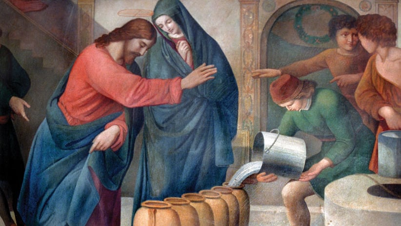

---

### إعلان مجئ الملكوت: التوق إلى الملكوت  

**أقدّم لك أيّتها البتول الطوباويّة، جزيل النور الذي أفيض عليك، لمّا أعلن يسوع مجيء ملكوت الله، ودعا الجميع إلى التوبة.**

«حانَ الوَقتُ وَٱقْتَرَبَ مَلَكوتُ الله. فَتوبوا وآمِنوا بِالبِشارة» (مرقس 1: 15)

**تأمّل:** إنّها الرسالة التي جاء من أجلها يسوع، وهي إعلان مجيء الملكوت، ودعوة الجميع إلى توبة صادقة ومصالحة حقيقيّة مع الربّ: “حان الوقت واقترب ملكوت الله، فتوبوا وآمنوا بالإنجيل”. إنّ سرّ محبّة الله للعالم لا يدرك، إلاّ عندما ندخل في أعماقه من خلال سرّ الفداء والصليب. هنا تتجلّى محبّته ويتمّ زمن التوبة والمصالحة. لذلك علينا أن نجيب على نداءاته المتكرّرة لنا، وأن نفهمها كما فهمتها مريم منذ البشارة، وسارت بوحيها إلى أسمى المراتب عندما اختيرت أمًا للرب. فيا أمّنا، ساعدينا كي نفتح أعيننا على النور الحقيقيّ، فنتصالح مع الله من خلال إخوتنا. هكذا فقط نلبّي نداءه بيسوع إبنك. آمين.

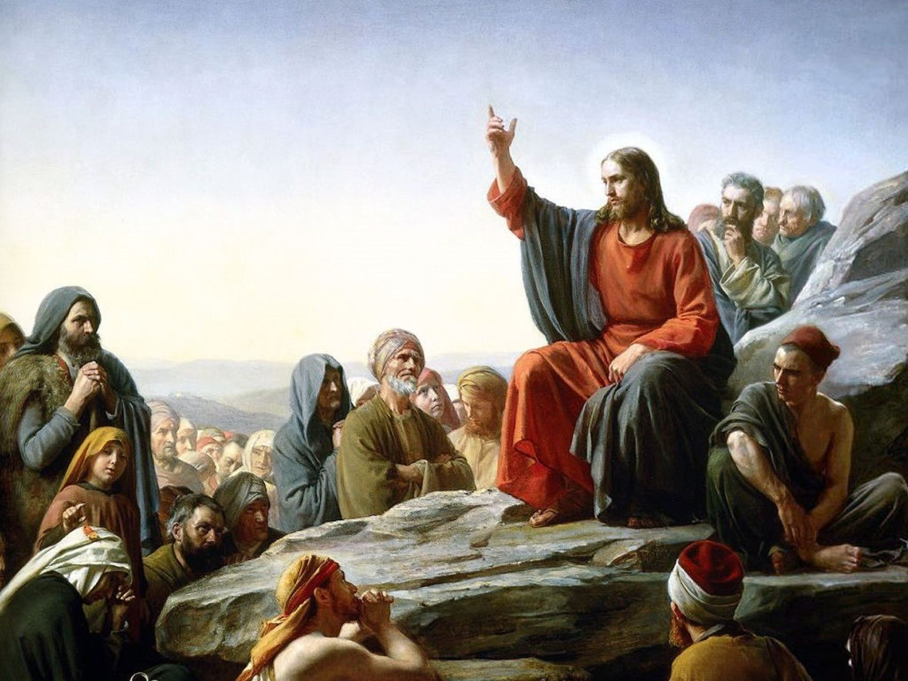

---

### التجلي: اتباع تعاليم يسوع  

**أقدّم لك أيّتها البتول الطوباويّة، جزيل النور الذي أفيض عليك، لمّا تلألأت صورة الآب على وجه يسوع ابنك في تجلّيه على الجبل.**

١وبَعدَ سِتَّةِ أَيَّام مَضى يسوعُ بِبُطرسَ ويَعقوبَ وأَخيه يوحَنَّا، فٱنفَردَ بِهِم عَلى جَبَلٍ عالٍ، ٢وتَجَلَّى بِمَرأًى مِنهُم، فأَشَعَّ وَجهُه كالشَّمس، وتَلألأَت ثِيابُه كالنُّور.
(متى 17: 1-2)

**تأمّل:** إنّ يسوع مرّة أخرى يظهر مجده لتلاميذه، فتنفتح أعينهم، ويدركوا سرّ علاقته بأبيه. “لقد تألّق مجد الألوهيّة على وجهه”. فعلى الجبل، “بينما هو يصلّي، تغيّر وجهه، وصارت ثيابه بيضاء تتلألأ كالبرق، وانطلق صوت من الغمام يقول: هذا هو إبني الذي اخترته، فله اسمعوا”. نسألك يا ربّ، بشفاعة أمّ الطهارة مريم، أن تجعل قلوبنا تتلألأ طهرًا، وضمائرنا نقاء، ونور تجلّيك يخرق عيوننا، فلا نعد عميان البصيرة عن سرّ حبّك الكبير، وشوقك الأزليّ لنا ونصغي إلى صوتك لنعكس نورك للآخرين. فنصعد جميعًا جبل القداسة، ونتجلّى حبًا وطهرًا وسلامًا. آمين.

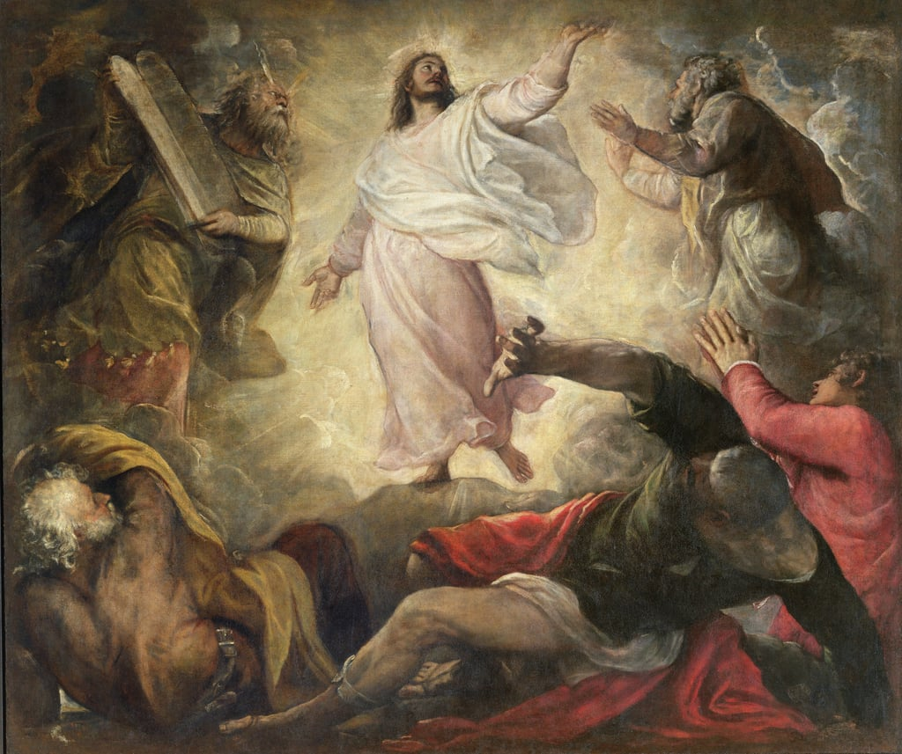

---

### العشاء السري: المشاركة في الذبيحة الإلهية.

**أقدّم لك أيّتها البتول الطوباويّة، جزيل النور الذي أفيض عليك، لمّا قدّم إبنك يسوع ذاته طعامًا لنا في العشاء السرّي.**

وبَينَما هم يَأكُلون، أَخذَ يسوعُ خُبزًا وبارَكَ ثُمَّ كَسَرَه وناوَلَه تلاميذَه وقال: «خُذوا فَكُلوا، هٰذا هُوَ جَسَدي». (متى 26: 26)  

**تأمّل:** إنّه منتهى الحبّ، هذا الذي أحبّنا به الله. “ما من حبّ أعظم من أن يبذل الإنسان نفسه عن أحبّائه”،حتّى قدّم لنا جسده ودمه غذاء أبديًا تحت شكلي الخبز والخمر، “فأعطى حتّى النهاية شهادة حبّه المتواصل للبشريّة”. نطلب منك أيّتها العذراء القدّيسة، أن تذكّرينا كلّما تقدّمنا من سرّ القربان، بأنّنا نتناول يسوع المحبّة والتضحية الكاملة، فنكون مستعدّين لاستقبال هذا الجود الإلهيّ، بتوبة صادقةٍ، وقلب نقيّ، ومظهر لائق،ليكون لنا هذا القربان غذاء يحيي نفوسنا ويطهّر أجسادنا للحياة الأبديّة. آمين.

---
---

# أسرار الحزن:  
ليومي الثلاثاء والجمعة، ومن أحد الكهنة إلى أحد القيامة
### صلاة يسوع في البستان: الندامة  

**أقدّم لكِ أيّتها البتول الطوباويّة، جزيل الحزن الذي حزنته، لمّا صلّى إبنكِ يسوع في البستان، وكان عرقه يتساقط كعبيط الدم.**

ثُمَّ جاءَ يسوعُ معَهم إِلى ضَيعَةٍ يُقالُ لها جَتسَمانِيَّة، فقالَ لِلتَّلاميذ: «أُمكُثوا هُنا، رَيثَما أَمضي وأُصَلِّي هُناك». ٣٧ومضى ببُطرسَ وَٱبنَيْ زَبَدى، وجَعَل يَشعُرُ بالحُزْنِ والكآبة. ٣٨فقالَ لَهم: «نَفسي حَزينَةٌ حتَّى المَوْت. أُمكُثوا هُنا وٱسهَروا مَعي».
٣٩ثُمَّ أَبعَدَ قَليلًا وسَقَطَ على وَجهِهِ يُصَلِّي فيقول: «يا أَبتِ، إِن أَمكَنَ الأَمْرُ، فَلتَبتَعِدْ عَنِّي هٰذِهِ الكَأس، ولٰكن لا كما أَنا أَشاء، بَل كما أَنتَ تَشاء!»
(متى 26: 36-39)

**تأمل:** “يا أبتِ، إن شئت فأصرف عنّي هذه الكأس… ولكن لا مشيئتي، بل مشيئتك!” هذه الكلمات يا مريم، قالها يسوع، وهو يصلّي في بستان الزيتون؛ لأنّه كان يعرف تماماً، إنّ الكأس التي سيشربها كفّارة عن خطايانا، ستكون مرّة للغاية. ساعدينا يا مريم، لنتمّم بسيرتنا المستقيمة، مشيئة الآب السماويّ، فنقول على مثال ابنكِ: “ولكن لا مشيئتي بل مشيئتك”، آمين.

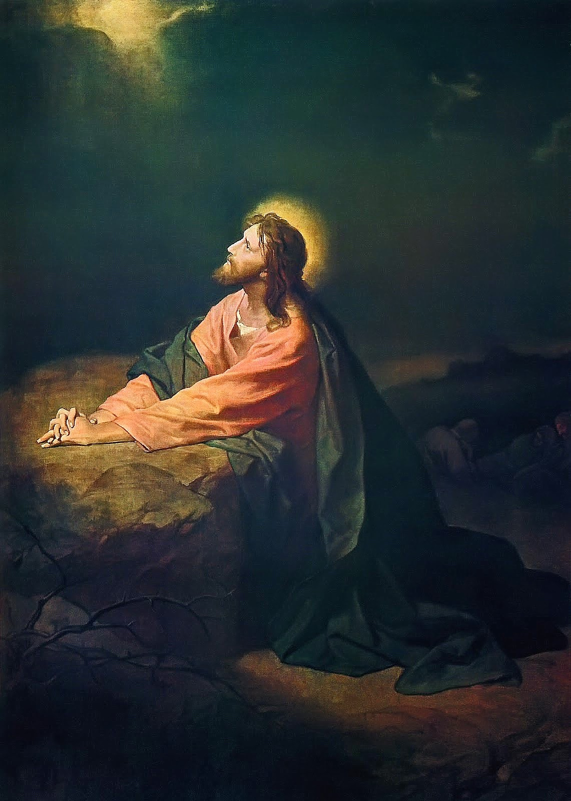

---

### الجلد: إماتة الحواس  

**أقدّم لكِ أيّتها البتول الطوباويّة، جزيل الحزن الذي حزنته، لمّا جُلد إبنكِ على العمود بالسياط.**

فأَطلَقَ لَهم بَرْأَبَّا، أَمَّا يسوع فجَلَدَه، ثُمَّ أَسلَمَه لِيُصلَب. (متى 27: 26)

**تأمّل:** كلّ جلدة لمست جسد يسوع الطاهر، وهو مربوط على العمود، كانت ثمناً لمعاصينا. وكلّ ألم سبّبته ضربات السياط الموجعة، كانت بسبب آثام ارتكبناها نحن البشر، ضدّ الإرادة الإلهيّة. أي خطأ إقترفته أيّها الحمل الوديع لكي تُجلد بدون رحمة. يا مريم، حزنك الجزيل توجعاً مع ابنكِ، كان يغمر قلبك الحنون، فكانت كلّ جلدة تمزّق أحشاءك. إجعلينا، أن نشارك إبنكِ جراحاته، فنصِل بمحبّتنا وتسامحنا، إلى سرّ صليبه، آمين.

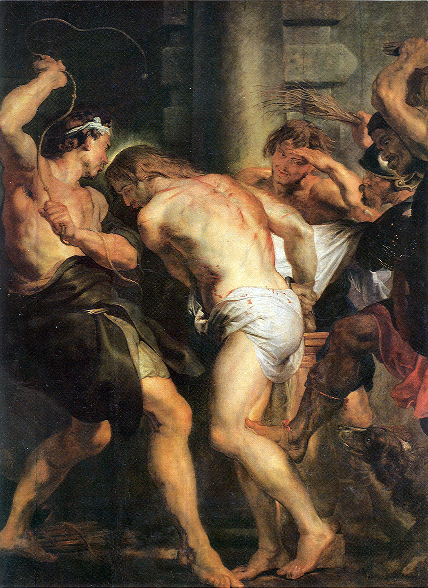

---

### إكليل الشوك: احتقار المجد العالمي  

**أقدّم لكِ أيّتها البتول الطوباويّة، جزيل الحزن الذي حزنته، لمّا كلّل إبنكِ بإكليل الشوك، على هامته المقدّسة.**

فمَضى جُنودُ الحاكِمِ بِيَسوعَ إِلى دارِ الحاكِم وجَمَعوا علَيه الكَتيبَةَ كُلَّها، ٢٨فجَرَّدوهُ مِن ثِيابِه وجَعَلوا علَيه رِداءً قِرمِزِيًّا، ٢٩وضَفَروا إِكليلًا مِن شَوكٍ ووَضَعوه على رأسِه، وجَعلوا في يَمينِه قَصَبَة، ثُمَّ جَثَوا أَمامَه وسخِروا مِنهُ فقالوا: «السَّلامُ عليكَ يا مَلِكَ اليَهود».

**تأمّل:** بعد احتمالك آلام الجلد المبرحة، كلّلت ايّها الفادي، بإكليل من شوك، وسخروا منك، لأنّك قلت أنّك ملك. لقد ملأ الحقد قلوبهم، وأعمت بصائرهم الضغينة والكره. كلّلت بالشوك، وأنت من جئت تزرع المحبّة، والرحمة بين البشر. أطلبي لنا يا مريم، أن لا نشارك يوماً في تعذيب ابنكِ، فلا نرتكب الخطيئة، ونتذكّر دائماً أنّها وحدها، سبب كلّ آلام يسوع، آمين.

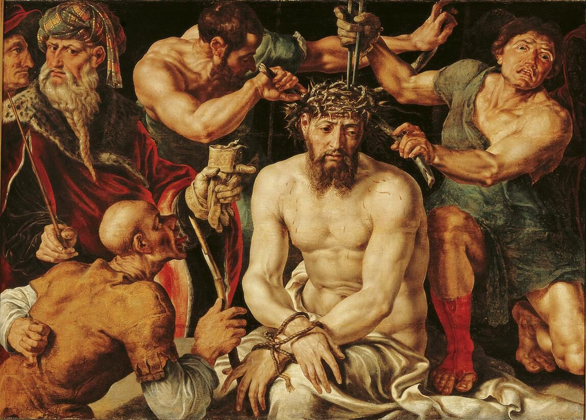

---

### يسوع يحمل صليبه: الصبر و التسليم  

** أقدّم لكِ أيّتها البتول الطوباويّة، جزيل الحزن الذي حزنته، لمّا حمل إبنكِ صليبه وكان من ثقله ينحني ساقطاً على الأرض كالميت.**

وسَخَّروا لِحَمْلِ صَليبِه أَحدَ المارَّةِ سِمْعانَ القيرينيّ أَبا الإِسكَندَرِ وَروفُس، وكانَ آتِيًا مِنَ الرِّيف. ٢٢وساروا بِه إِلى المَكانِ المَعروفِ بِالجُلْجُثة، أَي مَكانِ الجُمْجُمَة.(مرقس: 21-22)

**تأمّل:** حملت أيّها المسيح صليب الفداء، ومشيت على طريق الجلجلة الطويل، دون أن تفتح فاك؛ وأنت عالم بأنّ هذا ما ينتظرك، لأنّك لأجل ذلك جئت إلى العالم، كي ترفع بصليبك خطايا البشر. فيا معزيّة الحزانى، أي عزاء يخفّف عنك هذا الألم، الذي يعصر قلبك الرؤوف، اي عزاء يمحي من قلبك أوجاع الأم المفجوعة، وهي ترى ابنها الوحيد ينوء تحت ثقل صليبه. وحده وعدنا لك أن لا نهين بعد اليوم صليب من أحبّنا وافتدانا، آمين.

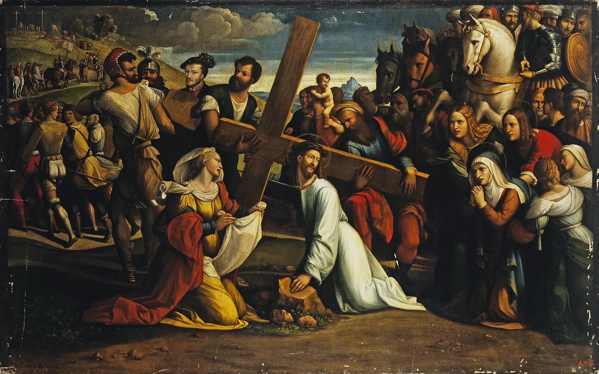

---

### الموت على الصليب: المحبة و المغفرة للأعداء  

**أقدّم لكِ أيّتها البتول الطوباويّة، جزيل الحزن الذي حزنته، لمّا مات إبنكِ على الصليب.**

ولمَّا وَصَلوا إِلى المَكانِ المَعروفِ بالجُمجُمة، صَلَبوهُ فيهِ والمُجرِمَيْن، أَحَدُهما عنِ اليَمينِ والآخَرُ عَنِ الشِّمال. ٣٤فقالَ يسوع: «يا أَبَتِ ٱغفِرْ لَهم، لِأَنَّهُم لا يَعلَمونَ ما يَفعَلون». ثُمَّ ٱقتَسموا ثِيابَه مُقتَرِعينَ علَيها.
٣٥ووقَفَ الشَّعْبُ هُناكَ يَنظُر، والرُّؤَساءُ يَهزَأُونَ فيقولون: «خَلَّصَ غَيرَهُ فَلْيُخَلِّصْ نَفْسَه، إِن كانَ مَسيحَ اللهِ المُختار!» ٣٦وسَخِرَ مِنه الجُنودُ أَيضًا، فدَنَوا وقرَّبوا إِلَيه خَلًّا وقالوا: ٣٧«إِن كُنتَ مَلِكَ اليَهود فخَلِّصْ نَفْسَكَ!» ٣٨وكانَ أَيضًا فَوقَه كِتابَةٌ خُطَّ فيها: «هٰذا مَلِكُ اليَهود».
٣٩وأَخَذَ أَحَدُ المُجرِمَينِ المُعَلَّقَينِ على الصَّليبِ يَشتُمُه فيَقول: «أَلستَ المَسيح؟ فخَلِّصْ نَفْسَكَ وخَلِّصْنا!» ٤٠فٱنتَهَرَه الآخَرُ قال: «أَوَما تَخافُ الله وأَنتَ تُعاني العِقابَ نَفْسَه! ٤١أَمَّا نَحنُ فعِقابُنا عَدْل، لِأَنَّنا نَلْقى ما تَستَوجِبُه أَعْمالُنا. أَمَّا هو فلَم يَعمَلْ سُوءًا». ٤٢ثُمَّ قال: «أُذكُرْني يا يسوع إِذا ما جئتَ في مَلَكوتِكَ». ٤٣فقالَ لَه: «الحَقَّ أَقولُ لَكَ: ستَكونُ اليَومَ مَعي في الفِردَوس».
٤٤وكانَتِ السَّاعَةُ نَحوَ الظُّهر، فخَيَّمَ الظَّلامُ على الأَرضِ كُلِّها حتَّى الثَّالِثَة، ٤٥لِأَنَّ الشَّمسَ قدِ ٱحتَجَبَت. وٱنشَقَّ حِجابُ المَقدِسِ مِنَ الوَسَط. ٤٦فصاحَ يسوعُ بِأَعلى صَوتِه قال: «يا أَبَتِ، في يَدَيكَ أَجعَلُ رُوحي!» قالَ هٰذا ولَفَظَ الرُّوح.

**تأمّل:** يا أبتِ، في يديك اجعل روحي، نتأمل معك يا مريم، بهذه الكلمات الأخيرة، التي بها أسلم ابنكِ الروح وهو معلّق على الصليب؛ ذاك الذي خلق السماء والأرض، من جاء ليرفع عارَنا، رُفع على خشبة العار؛ فغلب الموت بالموت، وهو ربّ الحياة، لكي نحيا معه للأبد. إنّ حزنكِ أيّتها الأم القدّيسة، يوازي كلّ العذابات في العالم. يا يسوع ويا مريم، ليكن وعدنا لكما صادقاً، بعدم الرجوع إلى الخطيئة. فنكون أمناء لهذا الافتداء المجيد، إلى آخر أيّام حياتنا، آمين.

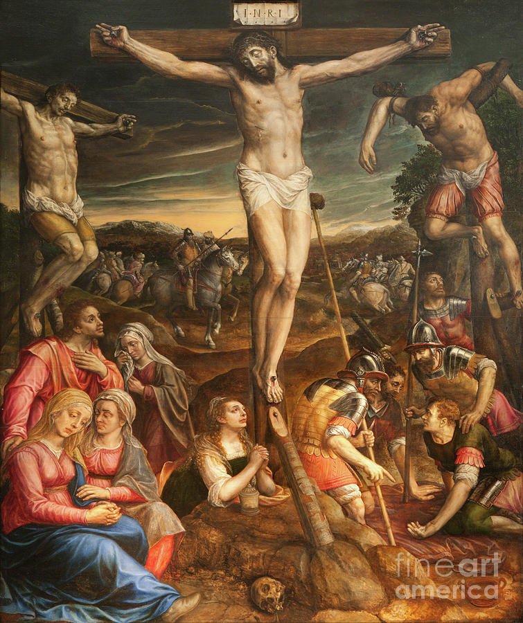

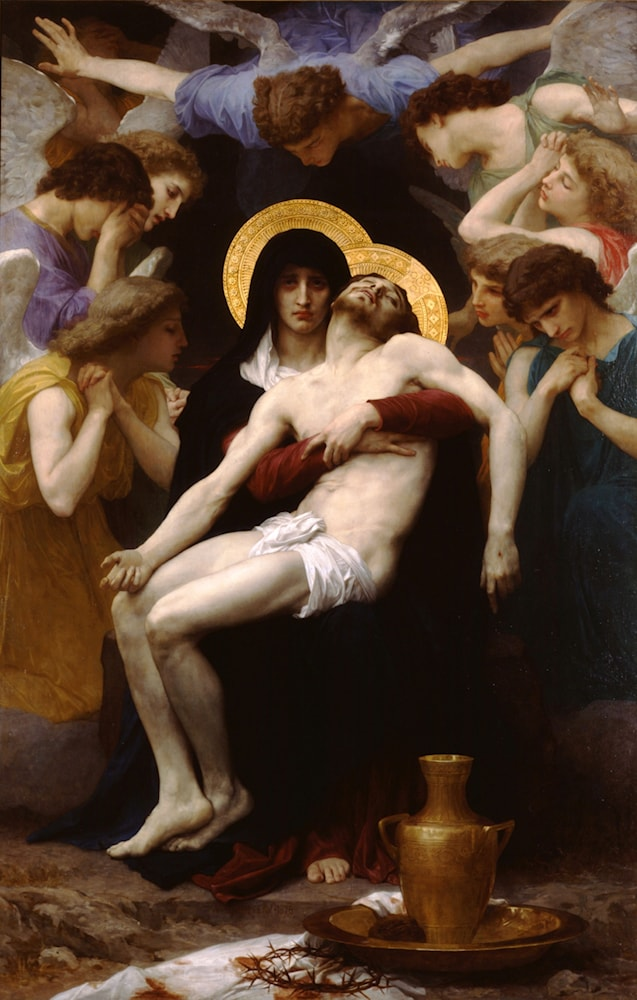

---
---

# أسرار المجد:  
ليومي الأحد والأربعاء، ومن أحد القيامة إلى العنصرة

### القيامة: النهوض من الخطية 

**أقدّم لكِ أيّتها البتول الطوباويّة، جزيل المجد الذي تمجّدته، لمّا قام إبنكِ من بين الأموات.**

وعِندَ فَجرِ يَومِ الأَحَد جِئنَ إِلى القَبْر، وهُنَّ يَحمِلنَ الطِّيبَ الَّذي أَعدَدنَه. ٢فوَجَدنَ الحَجَرَ قد دُحرِجَ عنِ القَبْر. ٣فدَخَلنَ فلَم يَجِدنَ جُثْمانَ الرَّبِّ يسوع. ٤وبَينَما هُنَّ في حَيرَةٍ مِن ذٰلك، إِذ حَضَرَهُنَّ رَجُلانِ علَيهِما ثِيابٌ بَرَّاقَة، ٥فخِفْنَ ونَكَسْنَ وُجوهَهُنَّ نَحوَ الأَرض، فقالا لَهُنَّ: «لِماذا تَبحَثنَ عنِ الحَيِّ بَينَ الأَموات؟ (لوقا 24: 1-5)

**تأمّل:** إنّنا نفرح معكِ أيّتها العذراء المجيدة، بقيامة ابنكِ يسوع منتصراً على الموت، قاهراً سلطانه. فأثبت أنّه وحده ربّ الحياة والموت، ولا أحد سواه. بالقيامة ابتدأ عهد جديد، عهد المحبّة والمصالحة والغفران. بالقيامة فُتحت أبواب السماء وأشرقت أنوار الربّ على المعمورة. إنّه الفرح الحقيقيّ بعد الحزن والألم. اجعلنا ربّي، بشفاعة والدتك القدّيسة، أن نعيش فرح القيامة مع إخوتنا طوال حياتنا، آمين.

---

### الصعود: الشوق إلى السماء  

**أقدّم لكِ أيّتها البتول الطوباويّة، جزيل المجد الذي تمجّدته، لمّا صعد إبنكِ إلى السماء، وجلس عن يمين الآب.**

١٩وبَعدَ ما كَلَّمَهُمُ الرَّبُّ يسوع، رُفِعَ إِلى السَّماء، وجَلَسَ عَن يَمينِ الله. (مرقس 16: 19)

**تأمّل:** انتهت رسالة يسوع على الأرض بجسده البشريّ، بعد أن عرّفنا على الله الآب. وكان لا بدّ أن يعود من حيث أتى. لقد أتمّ رسالته. فكانت أن علّمنا كيف نتوق إلى السماء، وأنّ منزلنا الحقيقيّ ليس على هذه الأرض. علّمينا يا أمّنا، أن نترفّع عن كلّ خيرات الأرض، فيكون اهتمامنا فقط، الاستعداد للقاء الآب السماويّ، حيث الحياة الأبديّة، وحيث الملكوت معدّ لنا، آمين.

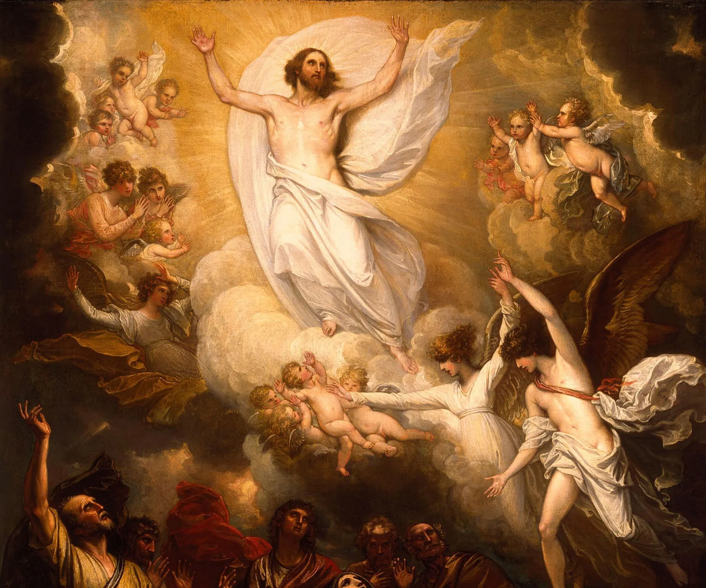

---

### حلول الروح القدس: الإصغاء لإلهامات الروح القدس  

**أقدّم لكِ أيّتها البتول الطوباويّة، جزيل المجد الذي تمجّدته، لمّا حلّ الروح القدس عليك وعلى التلاميذ الأطهار.**

لَمَّا أَتى اليَومُ الخَمْسون، كانوا مُجتَمِعينَ كُلُّهم في مَكانٍ واحِد، ٢فٱنْطَلَقَ مِنَ السَّماءِ بَغتَةً دَوِيٌّ كَريحٍ عاصِفَة، فمَلأَ جَوانِبَ البَيتِ الَّذي كانوا فيه، ٣وظَهَرَت لَهم أَلسِنَةٌ كأَنَّها مِن نارٍ قدِ ٱنقَسَمَت فوقَفَ على كُلٍّ مِنهُم لِسان، ٤فٱمتَلأُوا جَميعًا مِنَ الرُّوحِ القُدس، وأَخذوا يتكلَّمونَ بِلُغاتٍ غَيرِ لُغَتِهِم، على ما وَهَبَ لهُمُ الرُّوحُ القُدُسُ أَن يَتَكَلَّموا. (أعمال الرسل 2: 1-5)

**تأمّل:** صعد يسوع إلى السماء، ولكنّه لم يتركنا وحدنا. بل كما وعد، أرسل لنا الروح المعزّي، الذي يرشدنا ويدلّنا دوماً على طريقه، كي لا نضيع في مجاهل هذا العالم. فيا مريم، اطلبي لنا من الله، مواهب هذا الروح القدّوس، فلا نضلّ الطريق، بل يكون لنا النور، الذي يهدينا بثبات نحو الملكوت. وكما أمطرت السماء نعماً غزيرة، عليك وعلى التلاميذ يوم العنصرة، هكذا يا مريم فليكن لنا هذا، باستحقاقات قيامة المسيح، وبشفاعتك، آمين.

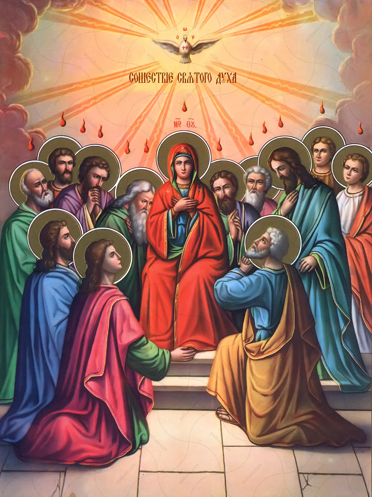

---

### الانتقال: الميتة الصالحة  

**أقدّم لكِ أيّتها البتول الطوباويّة، جزيل المجد الذي تمجّدته، لمّا انتقلت إلى السماء بالنفس والجسد.**

سَوفَ تُهَنِّئُني بَعدَ اليَومِ جَميعُ الأَجيال، لِأَنَّ القَديرَ صَنَعَ إِلَيَّ أُمورًا عَظيمة: قُدُّوسٌ ٱسمُه (لوقا 1: 48: 49)

**تأمّل:** ما أجمل ذكرك يا بنت الناصرة، ما أجمل فضائلك وما أسماها. لم، ولن يأتي بطن امرأة بمثلك يا أطهر الطاهرات. إنّ جسدك المقدّس، الذي حمل الإله، أبى الله أن يمسّه أي فساد؛ فحملته الملائكة، إلى قرب من كنت له أمّاً، من أرضعته ثدييك وحملته على يديك. لا تنسِ أولادك يا مريم، لا تنسِ كل من يطلب معونتك، ويلتمس شفاعتك. كلّ من يتلو ورديّتك، بكلّ إيمان ومحبّة. أطلبي لنا العون من ابنكِ، فنتحمّل بصبر آلامنا، لنحظى بالسعادة الأبديّة، آمين.

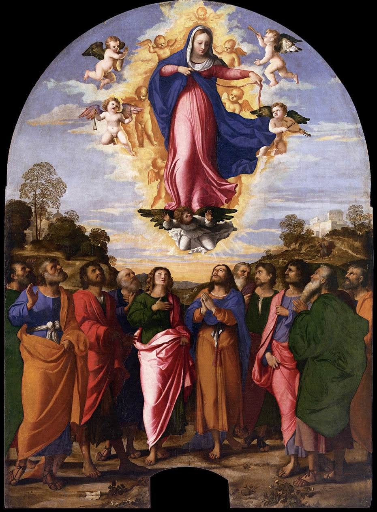

---

### تكليل العذراء: تكريم العذراء  

**أقدّم لكِ أيّتها البتول الطوباويّة، جزيل المجد الذي تمجّدته، لمّا تكلّلتِ بالمجد سلطانة على السماوات والأرض.**

ثُمَّ ظَهَرَت آيَةٌ عَظيمَةٌ في السَّماء: إِمرَأَةٌ مُلتَحِفَةٌ بِالشَّمْس، والقَمَرُ تَحتَ قَدَمَيها، وعلى رَأسِها إِكْليلٌ مِنِ ٱثنَي عَشَرَ كَوكَبًا، (رؤيا 12: 1)

**تأمّل:** أيّ تكريم أيتها المجيدة، أعظم من هذا. إنّه فعلاً يليق بوالدة الإله. كلّلك الثالوث الأقدس ملكة وسلطانة على السماوات والأرض. من يليق به هذا المنصب، سواك أيّتها العظيمة! يا ابنة الآب وأمّ الابن وعروسة الروح القدس. يا سلطانة الأنبياء والرسل، ويا سلطانة الورديّة المقدّسة؛ كوني لنا الشفيعة، لأنّك عظيمة عند الربّ. أطلبي لنا منه الرحمة. ولا تهملينا، بل املكي على حياتنا، ورافقينا عند ساعة موتنا، فنكرّمك مع الثالوث الأقدس، الآب والابن والروح القدس، آمين.

--- 
---

# صلاة ختام المسبحة 
السلام عليك يا سلطانة يا أم الرحمة، السلام عليك يا حياتنا و حلاوتنا و رجائنا، نصرخ اليك نحن المنفيين اولاد حواء، نتنهد اليك نائحين و باكين، في هذا الوادي وادي الدموع. فلذلك يا شفيعتنا، ميلي الينا بنظرك الحنون، و ارينا بعد هذا المنفى، يسوع، ثمرة بطنك المباركة، يا حنونة يا رؤوفة يا حلوة، يا مريم البتول.  
صلي لأجلنا يا والدة الله القديسة لكي نستحق مواعيد المسيح، امين
